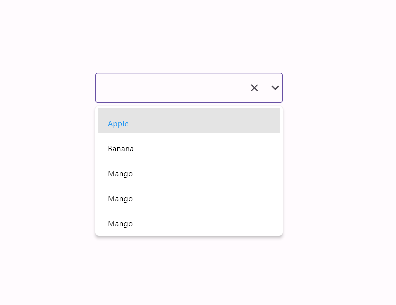

# `advanced_searchable_dropdown`

A customizable Flutter dropdown with search functionality, allowing users to filter and quickly select items from long lists. Fully customizable UI and behavior, ideal for scenarios with large datasets.

## Features

- Searchable dropdown list
- Customizable UI for the dropdown menu and items
- Flexible text field with optional label, hint, and icon support
- Clear button to reset the selected value
- Supports custom item builders
- Focus management and overlay for dropdown list display
- Lightweight and easy to integrate

## Badges

[](https://pub.dev/packages/advanced_searchable_dropdown)
[](https://opensource.org/licenses/MIT)

## Installation

Add `advanced_searchable_dropdown` as a dependency in your `pubspec.yaml` file:

```yaml
dependencies:
  advanced_searchable_dropdown: ^1.0.8
```

Then run the following command to install the package:

```bash
flutter pub add advanced_searchable_dropdown
flutter pub get
```

## Usage

### Basic Example

```dart
import 'package:flutter/material.dart';
import 'package:advanced_searchable_dropdown/advanced_searchable_dropdown.dart';

void main() {
  runApp(MyApp());
}

class MyApp extends StatelessWidget {
  @override
  Widget build(BuildContext context) {
    return MaterialApp(
      home: Scaffold(
        appBar: AppBar(title: Text('Searchable Dropdown')),
        body: Padding(
          padding: const EdgeInsets.all(16.0),
          child: SearchableDropDown(
            menuList: [
              SearchableDropDownItem(label: "Apple", value: 1),
              SearchableDropDownItem(label: "Banana", value: 2),
              SearchableDropDownItem(label: "Cherry", value: 3),
              SearchableDropDownItem(label: "Date", value: 4),
            ],
            value: 1,
            hintText: "Select a fruit",
            onSelected: (item) {
              print("Selected: ${item.label}");
            },
          ),
        ),
      ),
    );
  }
}
```

### Customization Options

| Property                 | Description                                                  |
|-----------------|-----------------------------------------------------------------------
| `menuMaxHeight`          | The maximum height of the dropdown menu.                                                              |
| `menuList`               | A list of `SearchableDropDownItem` that will appear in the dropdown menu.                             |
| `onSelected`             | Callback function triggered when an item is selected.                                                |
| `value`                  | The initial selected value (can be of any dynamic type).                                              |
| `onTapCancel`            | Callback function triggered when the user taps to cancel or close the dropdown (optional).            |
| `menuShape`              | The shape of the dropdown menu (e.g., `RoundedRectangleBorder`).                                      |
| `menuColor`              | Background color of the dropdown menu.                                                               |
| `contentPadding`         | Padding for the dropdown menu content.                                                               |
| `hintText`               | Placeholder text for the input field.                                                                |
| `label`                  | A widget to display as a label for the input field.                                                  |
| `menuTextStyle`          | Custom text style for the text inside the dropdown menu.                                              |
| `onSearch`               | Callback triggered when the text in the search input field changes.                                  |
| `itemBuilder`            | Custom builder function for rendering dropdown list items.                                           |
| `hoverColor`             | Color for the hover effect on dropdown items.                                                        |
| `validator`              | A function to validate the input text (returns an error message if invalid).                         |
| `errorStyle`             | Text style for displaying validation error messages.                                                |
| `textStyle`              | Custom style for the text displayed inside the input field.                                          |
| `autovalidateMode`       | Determines when validation should be triggered.                                                      |
| `enabled`                | A boolean that determines if the dropdown is enabled or disabled.                                    |
| `maxLines`               | Limits the number of lines in the text input field.                                                  |
| `decoration`             | Custom input field decoration (e.g., border, label).                                                 |
| `expands`                | If `true`, the input field will expand to fill the available space.                                  |
| `selectedColor`          | The color used for the selected item in the dropdown menu.                                           |
| `menuAlignment`          | Controls the alignment of the dropdown menu relative to the input field.                             |

---

### Example with Custom Item Builder

```dart
SearchableDropDown(
  menuList: [
    SearchableDropDownItem(label: "Apple", value: 1),
    SearchableDropDownItem(label: "Banana", value: 2),
    SearchableDropDownItem(label: "Cherry", value: 3),
    SearchableDropDownItem(label: "Date", value: 4),
  ],
  value: 1,
  hintText: "Select a fruit",
  onSelected: (item) {
    print("Selected: ${item.label}");
  },
  itemBuilder: (context, index) {
    return ListTile(
      leading: Icon(Icons.fastfood),
      title: Text(menuList[index].label),
    );
  },
)
```

## Screenshot


## Contributing

Contributions are welcome! Feel free to fork the repository, make changes, and open pull requests. If you find any issues or have suggestions for improvements, please open an issue.

## License

This package is licensed under the MIT License. See [LICENSE](LICENSE) for more information.

---
